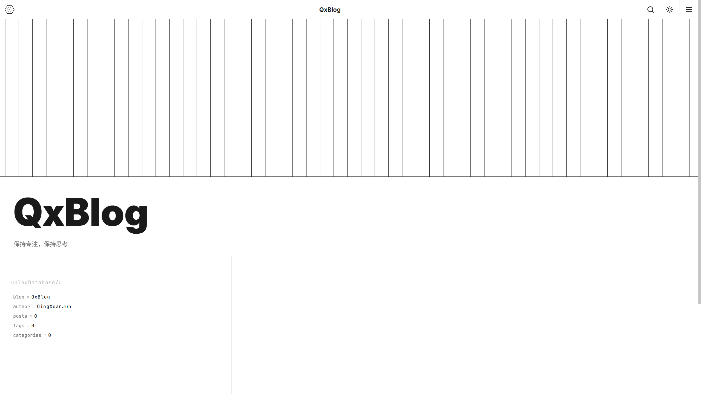

<div align="center">
    
    <h1>QxBlog</h1>
    <p>鍩轰簬 GitHub Issues 椹卞姩鐨勯潤鎬佷釜浜哄崥瀹?/p>


</div>

鍦?GitHub Issues 涓敤 Markdown 鍐欐枃绔狅紝GitHub Actions 鑷姩鏋勫缓骞堕儴缃插埌 GitHub Pages銆傛棤闇€鏈湴鐜锛屾棤闇€鏁版嵁搴擄紝鏃犻渶鏈嶅姟鍣ㄣ€?

## 婕旂ず



## 鎶€鏈爤

| 灞?| 閫夊瀷 |
|---|---|
| 鍓嶇 | 鍘熺敓 ES6 Modules锛岄浂妗嗘灦渚濊禆 |
| 鏍峰紡 | 绾?CSS锛屼寒/鏆楀弻涓婚 |
| 鏋勫缓 | Bun + featherdown |
| 閮ㄧ讲 | GitHub Actions + GitHub Pages |

## 鍔熻兘

- **鏂囩珷鍒嗛〉** 鈥?鐪佺暐鍙枫€侀〉鐮併€佸墠杩涘悗閫€銆丟O 璺宠浆
- **鍒嗙被绯荤粺** 鈥?Issue Label 鍗冲垎绫伙紝姣忎釜鍒嗙被鐙珛鍒嗛〉
- **鍏ㄦ枃鎼滅储** 鈥?鏍囬 / 鏍囩 / 姝ｆ枃鍖归厤锛屼笅鎷夌粨鏋滐紝閿洏 鈫戔啌 瀵艰埅
- **鏂囩珷鐩綍** 鈥?H2/H3 灞傜骇缂╄繘锛屼晶杈规爮閿氱偣璺宠浆
- **涓婚鍒囨崲** 鈥?鑷姩璺熼殢绯荤粺锛屾墜鍔ㄥ垏鎹紝鍐呰仈 script 闃查棯鐑?
- **浠ｇ爜澶嶅埗** 鈥?浠ｇ爜鍧?hover 涓€閿鍒?
- **渚ц竟鏍?* 鈥?澶村儚銆佹牸瑷€銆佸鑸摼鎺ワ紝鏃嬭浆鍏夌幆鍔ㄧ敾
- **Hero 鍖?* 鈥?棣栭〉鍏ㄥ睆 SVG 绾跨鍔ㄧ敾锛堝闈綋 + 杞ㄩ亾鐜?+ 鍗槦涓夎锛?
- **鍙嬫儏閾炬帴** 鈥?鏋勫缓鏃朵粠閰嶇疆鑷姩鍚屾
- **杩斿洖椤堕儴** 鈥?婊氬姩瓒呰繃 300px 娣″叆

## 鐩綍缁撴瀯

```
鈹溾攢鈹€ index.html                       # 棣栭〉锛圚ero + 鏂囩珷鍒楄〃锛?
鈹溾攢鈹€ 404.html                         # 404 椤甸潰锛堢嫭绔嬫牱寮忥紝璺熼殢涓婚锛?
鈹溾攢鈹€ articles/
鈹?  鈹溾攢鈹€ index.html                   # 鏂囩珷鍒楄〃椤?
鈹?  鈹斺攢鈹€ pages/{id}.html              # 鏂囩珷璇︽儏锛堟瀯寤虹敓鎴愶級
鈹溾攢鈹€ categories/
鈹?  鈹溾攢鈹€ index.html                   # 鍒嗙被鍒楄〃椤?
鈹?  鈹斺攢鈹€ {label}/index.html           # 鍒嗙被璇︽儏锛堟瀯寤虹敓鎴愶級
鈹溾攢鈹€ about/index.html                 # 鍏充簬椤?
鈹溾攢鈹€ blogData/                        # 鍔ㄦ€?JSON 鏁版嵁
鈹?  鈹溾攢鈹€ articles.json                #   鍏ㄩ噺鏂囩珷绱㈠紩
鈹?  鈹溾攢鈹€ articles/{page}.json         #   鏂囩珷鍒嗛〉
鈹?  鈹溾攢鈹€ categories.json              #   鍒嗙被鍒楄〃
鈹?  鈹斺攢鈹€ categories/{label}/{p}.json  #   鍒嗙被鍒嗛〉
鈹溾攢鈹€ js/                              # ES6 鍓嶇妯″潡
鈹?  鈹溾攢鈹€ default.js                   #   鍏ュ彛锛屽崗璋冨悇妯″潡
鈹?  鈹溾攢鈹€ config.js                    #   绔欑偣閰嶇疆鍔犺浇涓?UI 娓叉煋
鈹?  鈹溾攢鈹€ articles.js                  #   鏂囩珷鍔犺浇涓庡垎椤电粍浠?
鈹?  鈹溾攢鈹€ categories.js                #   鍒嗙被鍒楄〃鍔犺浇
鈹?  鈹溾攢鈹€ search.js                    #   鍏ㄦ枃鎼滅储锛堟祦寮忚鍙栵級
鈹?  鈹溾攢鈹€ nav.js                       #   瀵艰埅浜や簰锛堜富棰?/ 鎼滅储 / 渚ц竟鏍忥級
鈹?  鈹斺攢鈹€ toc.js                       #   鏂囩珷鐩綍渚ц竟鏍?
鈹溾攢鈹€ css/
鈹?  鈹溾攢鈹€ default.css                  #   鍏ㄥ眬鏍峰紡
鈹?  鈹斺攢鈹€ font-awesome.min.css         #   鍥炬爣搴?
鈹溾攢鈹€ fonts/                           # Inter + FontAwesome
鈹溾攢鈹€ img/                             # Logo / 澶村儚 / 鎴浘
鈹溾攢鈹€ favicon.svg                      # 绔欑偣鍥炬爣
鈹溾攢鈹€ config/
鈹?  鈹溾攢鈹€ siteConfig.json              #   鍓嶇灞曠ず閰嶇疆
鈹?  鈹斺攢鈹€ buildConfig.json             #   鏋勫缓琛屼负閰嶇疆
鈹斺攢鈹€ .github/
    鈹溾攢鈹€ workflows/qxblog-build.yml   #   CI 宸ヤ綔娴?
    鈹斺攢鈹€ script/
        鈹溾攢鈹€ qxBlogBuild.js           #     闈欐€佺珯鐐圭敓鎴愬櫒
        鈹溾攢鈹€ package.json             #     鏋勫缓渚濊禆
        鈹斺攢鈹€ bun.lock                 #     渚濊禆閿佹枃浠?
```

## 宸ヤ綔娴佺▼

### 鍙戝竷 / 鏇存柊鏂囩珷

鍦ㄤ粨搴?Issues 涓垱寤烘垨缂栬緫 Issue锛堟爣棰?+ Markdown 姝ｆ枃 + Label锛夛紝GitHub Actions 鑷姩瑙﹀彂锛?

```
Issue 浜嬩欢锛坥pened / edited / reopened锛?
  鈫?鏍￠獙 Issue 浣滆€?= buildConfig.author
  鈫?featherdown 娓叉煋 Markdown 鈫?HTML
  鈫?鍐欏叆 articles/pages/{id}.html
  鈫?鏇存柊 blogData/articles.json 鍏ㄩ噺绱㈠紩
  鈫?閲嶇畻鍒嗛〉 鈫?blogData/articles/{page}.json
  鈫?閲嶇畻鍒嗙被 鈫?blogData/categories/{label}/{p}.json + categories/{label}/index.html
  鈫?閲嶅啓 articles/index.html銆乧ategories/index.html銆乮ndex.html
  鈫?git-auto-commit 鎻愪氦鎺ㄩ€?
  鈫?GitHub Pages 鑷姩閮ㄧ讲
```

### 鍒犻櫎鏂囩珷

鍒犻櫎 Issue 瑙﹀彂鐩稿悓娴佺▼锛岀Щ闄ゅ搴?`{id}.html`銆佷粠绱㈠紩娓呴櫎銆侀噸绠楀垎椤靛拰鍒嗙被銆?

### 鍓嶇娓叉煋

```
椤甸潰鍔犺浇
  鈫?鍐呰仈 script 璇诲彇 localStorage / 绯荤粺涓婚锛岃缃?data-theme锛堥槻闂儊锛?
  鈫?QxConfig 娓叉煋瀵艰埅鏍忋€乴oader銆佷晶杈规爮銆乫ooter
  鈫?QxConfig 鍔犺浇 siteConfig.json锛屽～鍏?Hero / 鍏充簬 / 鍙嬫儏閾炬帴
  鈫?QxNav 缁戝畾涓婚鍒囨崲銆佹悳绱㈠睍寮€銆佷晶杈规爮寮€鍏?
  鈫?QxSearch 娴佸紡璇诲彇 articles.json锛屾瀯寤烘悳绱㈢储寮?
  鈫?QxArticles 鎷夊彇鍒嗛〉 JSON锛屾覆鏌撴枃绔犲崱鐗?+ 鍒嗛〉鎺т欢
  鈫?QxToc 涓烘枃绔犻〉鏋勫缓鐩綍渚ц竟鏍?
  鈫?loader 娣″嚭绉婚櫎
```

## 閰嶇疆

### buildConfig.json 鈥?鏋勫缓琛屼负

```json
{
    "author": "QingXuan2000",
    "timezoneOffset": "+08:00",
    "maxArticlesPerPage": 15,
    "friendLinks": []
}
```

| 瀛楁 | 璇存槑 |
|---|---|
| `author` | 鍙湁姝?GitHub 鐢ㄦ埛鍒涘缓鐨?Issue 浼氳鏋勫缓 |
| `timezoneOffset` | 鏂囩珷鏃堕棿鍋忕Щ閲?|
| `maxArticlesPerPage` | 姣忛〉鏂囩珷鏁?|
| `friendLinks` | 鍙嬫儏閾炬帴锛屾瀯寤烘椂鑷姩鍚屾鍒?siteConfig.json |

### siteConfig.json 鈥?鍓嶇灞曠ず

```json
{
    "site": {
        "name": "QxBlog",
        "title": "QxBlog",
        "author": "QingXuanJun",
        "siteCreatedAt": "2026-03-01T00:00:00Z"
    },
    "hero": {
        "tag": "<Blog />",
        "title": "銆岀敤浠ｇ爜锛屽啓涓栫晫銆傘€?,
        "subtitle": "Thoughts on code, design, and everything in between."
    },
    "about": {
        "sections": [
            { "head": "鍏充簬鎴?, "text": "..." },
            { "head": "鍏充簬鏈珯", "text": "..." }
        ],
        "friendLinks": []
    },
    "sidebar": {
        "motto": "鐢ㄤ唬鐮侊紝鍐欎笘鐣屻€?,
        "links": [
            { "text": "<i class=\"fa fa-home\"></i> 棣栭〉", "href": "index.html" },
            { "text": "<i class=\"fa fa-file-text\"></i> 鏂囩珷", "href": "articles/index.html" },
            { "text": "<i class=\"fa fa-folder\"></i> 鍒嗙被", "href": "categories/index.html" },
            { "text": "<i class=\"fa fa-user\"></i> 鍏充簬", "href": "about/index.html" }
        ]
    }
}
```

鎺у埗 Hero 鍖烘枃妗堛€佷晶杈规爮瀵艰埅銆佸叧浜庨〉娈佃惤銆丗ooter 鐗堟潈骞翠唤銆俙about.friendLinks` 鐢辨瀯寤鸿剼鏈粠 `buildConfig.json` 鍚屾锛屾棤闇€鎵嬪姩缁存姢銆?

## 鑷畾涔?

1. **Fork 鏈粨搴?*锛屽惎鐢?GitHub Actions 鍜?GitHub Pages锛圫ource: Actions锛?
2. 淇敼 `config/siteConfig.json` 鈥?绔欑偣鍚嶇О銆佷綔鑰呫€丠ero 鏂囨銆佸叧浜庨〉
3. 淇敼 `config/buildConfig.json` 鈥?灏?`author` 鏀逛负浣犵殑 GitHub 鐢ㄦ埛鍚?
4. 鏇挎崲 `img/Avatar.png` 鍜?`img/logo.svg`
5. 鍦?Issues 涓垱寤烘枃绔犲嵆鍙Е鍙戞瀯寤洪儴缃?

